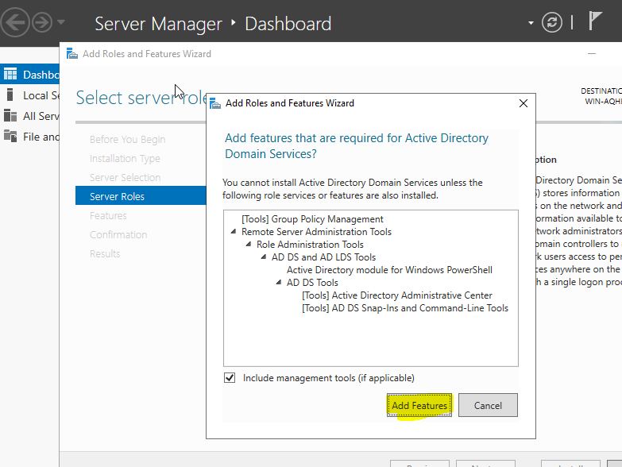
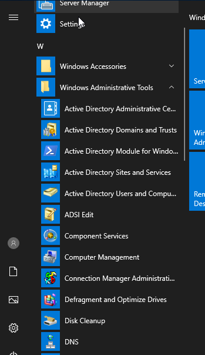
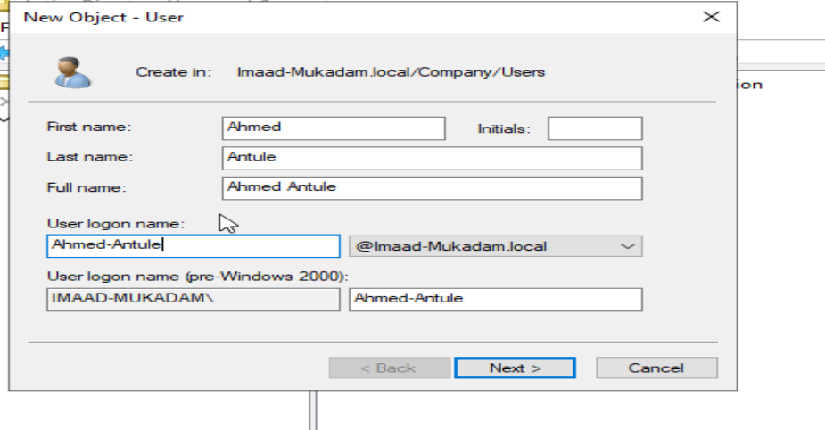

# Installing-Active-Directory-on-Windows-Server

### **Windows Active Directory (AD) – Centralized Identity & Access Management**  

Windows **Active Directory (AD)** is a **directory service** developed by Microsoft that helps **manage users, computers, and resources** in a network. It is used in **enterprise environments** to provide **centralized authentication, authorization, and security policies**.  

### **Key Features:**  
✅ **User & Group Management** – Centralized control over user accounts, groups, and permissions.  
✅ **Authentication & Authorization** – Uses **Kerberos and LDAP** for secure user logins.  
✅ **Group Policy Management** – Enforces security settings, software installations, and network configurations.  
✅ **Single Sign-On (SSO)** – Users can access multiple applications with **one set of credentials**.  
✅ **Domain Services** – Organizes network resources into **domains, forests, and organizational units (OUs)**.  

### **Why Use Active Directory?**  
🔹 **Centralized Security** – Manages access control across the organization.  
🔹 **Scalability** – Supports thousands of users, devices, and applications.  
🔹 **Integration** – Works with Microsoft services like **Azure AD, Exchange, and SharePoint**.  
🔹 **Improved Productivity** – Users sign in once and access multiple resources without re-entering credentials.  

### **Common Use Cases:**  
- **Enterprise IT Management** – Controlling access to corporate networks and devices.  
- **User Authentication & SSO** – Secure logins for employees across applications.  
- **Access Control & Security** – Implementing policies for **passwords, firewalls, and permissions**.  

Windows Active Directory is essential for **managing and securing** enterprise networks, ensuring **efficient user and resource management**. 🚀

### **Summary: Setting Up Active Directory on Windows Server 2019**  

In this project, I installed and configured **Active Directory (AD) on Windows Server 2019** to manage users, groups, and computers within an organization. The steps include:  

- **Installing Active Directory Domain Services (AD DS)** on **Windows Server 2019**.  
- **Creating an Organizational Unit (OU)** to structure and manage directory objects.  
- **Adding Users, Groups, and Computer OUs** for efficient identity and access management.  

This setup enables **centralized authentication, authorization, and resource management**, ensuring **secure and efficient user administration** within the domain. 🚀

## Step - 1 

i. **Click on "Manage," then select "Add Roles and Features."**

ii. **Go to "Server Roles," then select and install "Active Directory Domain Services (AD DS)."**

iii. **Go to the "Confirmation" section and click "Install."**

iv. **Once the installation is complete, click on "Promote this server to a domain controller."**

### **Why Click on "Promote This Server to a Domain Controller" in Active Directory Setup?**  

After installing **Active Directory Domain Services (AD DS)** on **Windows Server 2019**, the server needs to function as a **Domain Controller (DC)**. Clicking **"Promote This Server to a Domain Controller"** is necessary because:  

✅ **Activates Directory Services** – It enables the **Active Directory database**, allowing user authentication, group management, and security policies.  
✅ **Creates or Joins a Domain** – It lets you either **create a new domain** (e.g., `mycompany.local`) or **add the server to an existing domain**.  
✅ **Manages Authentication & Security** – The Domain Controller is responsible for **verifying user logins, managing group policies, and securing access**.  
✅ **Enables Group Policies (GPOs)** – Once promoted, you can enforce **security settings, software deployment, and administrative controls** across the network.  

Without **promoting the server to a Domain Controller**, the installed **Active Directory services won't be functional**, and the server will not manage users, groups, or policies effectively. 🚀

v. **Click on "Add a New Forest" and enter the root domain name with the `.local` extension.**

Why Click on "Add a New Forest" in Active Directory Setup?
When promoting a server to a Domain Controller (DC), you need to define its role in the Active Directory structure. Clicking "Add a New Forest" is required when setting up Active Directory for the first time

Why Use .local for an Active Directory Domain?
When setting up Active Directory (AD), you need to choose a domain name for your organization. Many administrators use .local (e.g., company.local) instead of a public domain name. Here’s why:

✅ Avoids Conflicts with Public Domains – Using a real domain (e.g., company.com) could cause DNS conflicts if your internal and external resources share the same name.
✅ Simplifies Internal Network Management – .local is only used within the internal network, making it easier to manage internal DNS without affecting public websites.
✅ Prevents Accidental Exposure – A .local domain cannot be resolved on the internet, adding an extra layer of security by preventing external access.
✅ Does Not Require Public DNS Registration – Unlike a real domain (company.com), .local does not need to be registered, saving costs and simplifying setup

vi. **In the Domain Controller configuration, set and confirm the password for the domain.**

vii. **Click "Next" until you reach the prerequisites check, then click "Install."**

The VM will restart, and once it boots up, you will see that your domain has been successfully created.

After logging in, you can view the installed components and configured settings within the Active Directory environment.

## Step - 2

i. **Open "Active Directory Users and Computers" (ADUC).**

ii. **Right-click on your domain and select "New" > "Organizational Unit" to create a new OU.**

What is an Organizational Unit (OU) in Active Directory?
An Organizational Unit (OU) in Active Directory (AD) is a logical container used to organize and manage users, groups, computers, and other objects within a domain. It helps in structuring the directory to apply group policies and delegate administrative tasks efficiently

Example of OU Structure:
📂 Company.local (Root Domain)
├── HR (OU) → Users & Computers for HR
├── IT (OU) → Users & Computers for IT Team
├── Finance (OU) → Users & Computers for Finance

By using Organizational Units, businesses can structure their Active Directory efficiently, making it easier to manage users, devices, and policies. 🚀

ii. I have created an Organizational Unit (OU) named **Company**, which contains multiple sub-OUs for **Users, Groups, Computers, and Servers**.

iii. Steps to Create a New User

Enter the password and select the checkbox below as per the company's policy.

